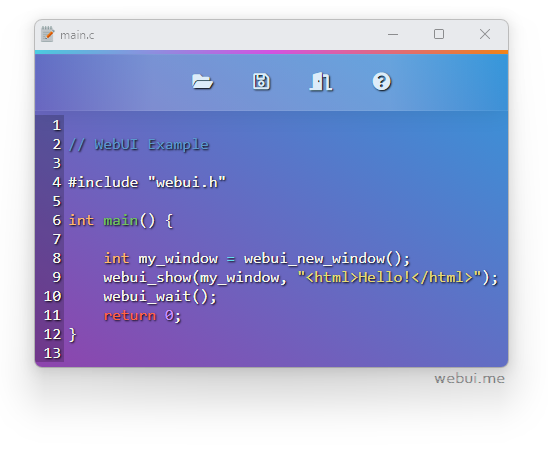

# Webinix C - Text Editor

This [text editor example](https://github.com/webinix-dev/webinix/tree/main/examples/C/text-editor) is written in C using Webinix as the GUI library. The final executable is portable and has less than _1 MB_ in size (_+html and css files_).



### Windows

- **MinGW**
```sh
git clone https://github.com/webinix-dev/webinix.git
cd webinix\examples\C\text-editor
gcc -o text-editor.exe text-editor.c webinix-2.dll -Wl,-subsystem=windows -lcomdlg32
```
