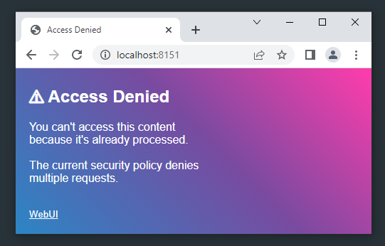

# Webinix C APIs

- [Get Started](/c_api?id=get-started)
- [Example](/c_api?id=example)
- Window
    - [New Window](/c_api?id=new-window)
    - [Show Window](/c_api?id=show-window)
    - [Window status](/c_api?id=window-status)
- Binding
    - [Bind](/c_api?id=Bind)
    - [Bind All](/c_api?id=bind-all)
- Application
    - [Wait](/c_api?id=wait)
    - [Exit](/c_api?id=exit)
    - [Close](/c_api?id=close)
    - [App status](/c_api?id=app-status)
    - [Startup Timeout](/c_api?id=startup-timeout)
    - [Multi Access](/c_api?id=multi-access)
- [Event](/c_api?id=event)
- [Run JavaScript](/c_api?id=script)
- [Server](/c_api?id=server)

---
### Get Started

This document includes all Webinix APIs available for the C/C++ application. To begin, you need to clone the Webinix repo and build it from the source using any C compiler, No need for any external dependencies.

Windows MSVC
```console
git clone https://github.com/alifcommunity/webinix.git
cd webinix\build\Windows\MSVC
nmake
```

Windows MinGW
```console
git clone https://github.com/alifcommunity/webinix.git
cd webinix\build\Windows\GCC
mingw32-make
```

Windows TCC
```console
git clone https://github.com/alifcommunity/webinix.git
cd webinix\build\Windows\TCC
mingw32-make
```

Linux GCC
```console
git clone https://github.com/alifcommunity/webinix.git
cd webinix\build\Linux\GCC
make
```

Linux Clang
```console
git clone https://github.com/alifcommunity/webinix.git
cd webinix\build\Linux\Clang
make
```

For more instructions, please visit [Build Webinix](https://github.com/alifcommunity/webinix/tree/main/build) in our GitHub repository.

---
### Example

A minimal C example

```c
#include "webinix.h"

int main() {

    webinix_window_t* win = webinix_new_window();
    webinix_show(win, "<html>Hello!</html>", webinix.browser.any);
	webinix_wait();
    return 0;
}
```

Please visit [C Examples](https://github.com/alifcommunity/webinix/tree/main/examples/C) in our GitHub repository for instructions on compiling this example or finding more complete examples.

---
### New Window

To create a new window object, you can use `webinix_new_window()`, which returns a pointer to a struct `webinix_window_t`. This pointer does *NOT* need to be freed.

```c
webinix_window_t* my_window = webinix_new_window();
```

---
### Show Window

To show a window, you can use `webinix_show()`. If the window is already shown, the UI will get refreshed in the same window.

```c
const char* my_html = "<html>Hello!</html>";

// Any available web browser
webinix_show(my_window, my_html, webinix.browser.any);
```

Show a window in a specific web browser

```c
const char* my_html = "<html>Hello!</html>";

// Chrome
webinix_show(my_window, my_html, webinix.browser.chrome);

// Firefox
webinix_show(my_window, my_html, webinix.browser.firefox);

// Microsoft Edge
webinix_show(my_window, my_html, webinix.browser.edge);
```

If you need to update the whole UI content, you can use `webinix_refresh()`, which allows you to refresh the window UI with any new HTML content.

```c
const char* html = "<html>Hello</html>";
const char* new_html = "<html>New World!</html>";

// Open a window in Chrome
webinix_show(my_window, html, webinix.browser.chrome);

// Later...

// Refresh the same window with the new content
webinix_refresh(my_window, new_html);
```

In some exceptional cases, like in the Webinix Rust wrapper, you need that the Webinix keep a copy of the HTML content instead of keeping the pointer to the original source, this will come in handy when your HTML pointer is not guaranteed to stay alive. in this case, please use `webinix_show_cpy()`.

```c
char* ptr_html;
// malloc()...

// Open a window in Chrome & keep a valid copy of the HTML content
webinix_show_cpy(my_window, html, webinix.browser.chrome);

// You can now safely free ptr_html
```

---
### Window Status

In some exceptional cases, you want to know if any opened window exists, for that, please use `webinix_is_any_window_running()`, which returns *True* or *False*.

```c
if(webinix_is_any_window_running())
    printf("Some windows still running");
else
    printf("All windows are closed.");
```

To know if a specific window is running, you can use `webinix_is_shown()`.

```c
if(webinix_is_shown(my_window))
    printf("The window is still running");
else
    printf("The window is closed.");
```

---
### Bind

Use `webinix_bind()` to receive click events when the user clicks on any HTML element with a specific ID, for example `<button id="MyID">Hello</button>`.

```c
void my_function(webinix_event_t* e) {
    ...
}

webinix_bind(my_window, "MyID", my_function);
```

---
### Events

You can listen for events by biding an empty ID.

```c
void events(webinix_event_t* e) {
    ...
}

webinix_bind(my_window, "", events);
```

---
### Wait

It is essential to call `webinix_wait()` at the end of your main function, after you create/shows all your windows. This will make your application run until the user closes all visible windows or when calling *[webinix_exit](/c_api?id=exit)*.

```c
int main() {

	// Create windows...
	// Bind HTML elements...
    // Show the windows...

    // Wait until all windows get closed
    // or when calling webinix_exit()
	webinix_wait();

    return 0;
}
```

---
### Exit

At any moment, you can call `webinix_exit()`, which tries to close all related opened windows and make *[webinix_wait](/c_api?id=wait)* break.

```c
webinix_exit();
```

---
### Close

You can call `webinix_close()` to close a specific window, if there is no running window left *[webinix_wait](/c_api?id=wait)* will break.

```c
webinix_close(my_window);
```

---
### App Status

In some exceptional cases, like in the Webinix-TypeScript wrapper, you want to know if the whole application still running or not, for that, please use `webinix_is_app_running()`, which returns *True* or *False*.

```c
if(webinix_is_app_running())
    printf("The application is still running");
else
    printf("The application is closed.");
```

---
### Startup Timeout

Webinix waits a couple of seconds to let the web browser start and connect, you can control this behavior by using `webinix_set_timeout()`.

```c
// Wait 10 seconds for the web browser to start
webinix_set_timeout(10);

// After 10 seconds, if the web browser did
// not start yet, webinix_wait() will return
webinix_wait();
```
```c
// Wait forever.
webinix_set_timeout(0);

// webinix_wait() will never end
webinix_wait();
```

---
### Multi Access



After the window is loaded, for safety, the used URL is not valid anymore, if someone else tries to access the URL Webinix will show an error. To allow multi-user access to the same URL, you can use `webinix_multi_access()`.

```c
webinix_multi_access(my_window, true);
```

---
### Event

When you use *[webinix_bind](/c_api?id=bind)*, your application will receive an event every time the user clicks on the specified HTML element. The event comes with the `element_name`, which is The HTML ID of the clicked element, for example, `MyButton`, `MyInput`.., The event also comes with the Webinix unique element ID & the unique window ID. Those two IDs are not generally needed, except if you write a wrapper for Webinix in a language other than C.

```c
void my_function(webinix_event_t* e){

	printf("Hi!, You clicked on %s element\n", e.element_name);
}
```

The *e* corresponds to Event, and it has those elements:

```c
unsigned int window_id;     // Webinix unique window ID
unsigned int element_id;    // Webinix unique element ID
char* element_name;         // The HTML ID of the clicked element
webinix_window_t* window;     // Pointer to the current window
```

---
### Script

You can run JavaScript on any window to read values, update the view, or anything else. In addition, you can check if the script execution errors, as well as receive data.

```c
void my_function(webinix_event_t* e){

	webinix_script_t js = {
		.script = "alert('Hello');",    // JavaScript
		.timeout = 10                   // Max time to wait in seconds
	};

    // Execute
    webinix_script(e->window, &js);

    // Free resources
	webinix_script_cleanup(&js);
}
```

An example of how to run a JavaScript and get back the output as `char*` datatype, and check for errors, if any.

```c
void my_function(webinix_event_t* e){

	webinix_script_t js = {
		.script = "var foo = 2; var bar = 5; return foo * bar;"
	};

    // Execute
    webinix_script(e->window, &js);

	// Check if there is any JavaScript error
	if(js.result.error)
		printf("Error: %s\n", js.result.data);
    else
        printf("Output: %s\n", js.result.data);
    
    // Free resources
	webinix_script_cleanup(&js);
}
```

---
### Server

You can use Webinix to serve a folder, which makes Webinix act like a web server. To do that, please use `webinix_new_server()`, which returns the complete URL of the server.

```c
// Serve a folder
const char* url = webinix_new_server(my_window, "/path/to/folder");
```

```c
// Automatically select the current path
const char* url = webinix_new_server(my_window, "");
```

When you serve a folder, you probably want to run JavaScript & TypeScript files and show the output in the UI. To do that, you can use `webinix_script_runtime`, which makes Webinix act like Nodejs.

```c
// Chose your preferable runtime for .js & .ts files
// Deno: webinix.runtime.deno
// Node.js: webinix.runtime.nodejs

// Deno
webinix_script_runtime(my_window, webinix.runtime.deno);

// Nodejs
webinix_script_runtime(my_window, webinix.runtime.nodejs);
```

If you already have a URL, you can use Webinix to open a window using this URL. For that, please use `webinix_open()`.

```c
webinix_open(my_window, my_url, webinix.browser.chrome);
```

In addition, it can make Webinix track clicks and send you events by embedding the Webinix JavaScript bridge file `webinix.js`. Of course, this will work only if the server is Webinix.

```html
<script src="/webinix.js"></script>
```
